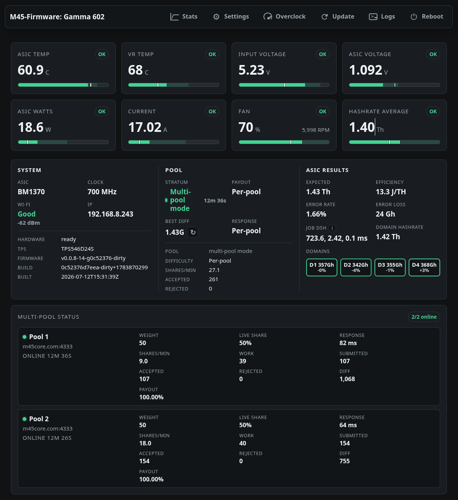

# M45 Gamma Firmware [ALPHA]



Alpha firmware for Bitaxe Gamma 602 speed testing, overclocking, and local
telemetry.

M45 is a focused ESP-IDF firmware for users who want faster startup, direct
ASIC speed controls, a compact local web dashboard, and clearer mining
telemetry than a general-purpose Bitaxe firmware. It boots with stock ASIC
settings by default and requires an explicit opt-in before overclock presets
can be applied.

Use this firmware at your own risk. Overclocking can permanently damage the
ASIC, voltage regulator, fan, wiring, or power supply, and can create a fire
risk. Do not run high clocks without the right cooling, power supply, and
temperature monitoring.

## Supported Hardware

This firmware targets Bitaxe Gamma 602 hardware:

- ESP32-S3 with 16 MB flash and octal PSRAM.
- BM1370 ASIC, stock default `525 MHz` at `1150 mV`.
- TPS546 PMBus regulator at I2C address `0x24`.
- EMC2101 fan controller on the Bitaxe I2C bus.
- SSD1306 OLED at `0x3c`, `128x32`, on the Bitaxe I2C bus.

Other boards may need source changes before they are safe to run.

## What It Does

- Starts the TPS546 regulator directly and validates ASIC voltage early.
- Brings the fan to 100% PWM at early boot before Wi-Fi, display, regulator,
  or ASIC setup.
- Provides a local web UI for live stats, settings, fan control, pool setup,
  and overclock presets.
- Shows OLED QR codes for first-time Wi-Fi setup and quick local web dashboard
  access.
- Applies web setting changes at runtime without requiring a reboot.
- Keeps overclocking disabled by default; when disabled, saved high clock or
  voltage values are ignored and stock settings are enforced.
- Includes stock-through-high overclock presets, manual frequency and voltage
  controls, and voltage offset adjustment.
- Shows ASIC state, clock, voltage, hashrate, ASIC temperature, regulator
  temperature, fan, power, best diff, block-found alerts, and pool status.
- Supports primary and backup Stratum pools with automatic return to the
  primary pool.
- Decodes coinbase payout data to check wallet percentage and warn when the
  configured wallet is not found.
- Clears stale Stratum work when pool difficulty changes.
- Uses no-store web headers and a per-boot page token to avoid stale cached UI
  and API responses after refreshes.

## Safety Limits

The firmware holds ASIC reset low and turns TPS546 output off if a critical
condition is detected:

- ASIC temperature reaches `69 C`.
- Enabled ASIC VOUT falls below `0.700 V`.
- ASIC VOUT reaches `1.400 V`.
- TPS546 temperature reaches `98 C`.
- Input VIN reaches `5.5 V`.
- TPS546 or temperature monitor reads fail while hardware is active.

These limits are last-resort protections, not a substitute for proper cooling
or power delivery.

## Build And Configure

Install ESP-IDF for `esp32s3`, source the ESP-IDF environment, then configure
and build:

```sh
scripts/build.sh \
  --wifi-ssid "My WiFi" \
  --wifi-pass "secret" \
  --pool-host public-pool.io \
  --pool-port 3333 \
  --pool-user "bc1q...worker" \
  --pool-pass x \
  --build
```

Flash after building:

```sh
scripts/build.sh --flash /dev/ttyUSB0
```

On first boot without saved Wi-Fi credentials, the device starts a temporary
setup AP named `m-XXXX` and shows a Wi-Fi QR code on the OLED. Scan it to join
the setup network, then open the displayed setup address to configure Wi-Fi and
mining pool settings.

After the device joins Wi-Fi, the OLED shows the local web dashboard address and
an HTTP QR code. Scan that QR code from a phone or tablet on the same network to
open the web panel directly.

You can also use standard ESP-IDF commands:

```sh
idf.py set-target esp32s3
idf.py build
idf.py -p /dev/ttyUSB0 flash monitor
```

## Source Stats

Tracked source and build-configuration files total `13,604` lines across `48`
files:

| Area | Files | Lines |
| --- | ---: | ---: |
| C source | 19 | 10,854 |
| C headers | 20 | 828 |
| Web HTML | 2 | 1,055 |
| Shell scripts | 1 | 400 |
| Python tools | 2 | 254 |
| Kconfig | 1 | 105 |
| CMake | 2 | 83 |
| ESP-IDF defaults | 1 | 25 |

These counts exclude README, license, notice, Git, and generated build files.

## Upstream References

This firmware uses BM1370 ASIC hardware and protocol details from
[`bitaxeorg/esp-miner`](https://github.com/bitaxeorg/esp-miner), including
chip detection, initialization register writes, UART baud commands, frequency
register programming, nonce-space setup, job packet format, result decoding,
register reads, and version-rolling result handling.

## Licensing

This repository is licensed under GPL-3.0. See `LICENSE`.

Third-party license details and upstream hardware references are tracked in
`THIRD_PARTY_NOTICES.md`. The esp-miner GPL text is kept at
`LICENSES/esp-miner-GPL-3.0.txt`, and the bundled QR code library uses the MIT
license text at `LICENSES/MIT.txt`.
